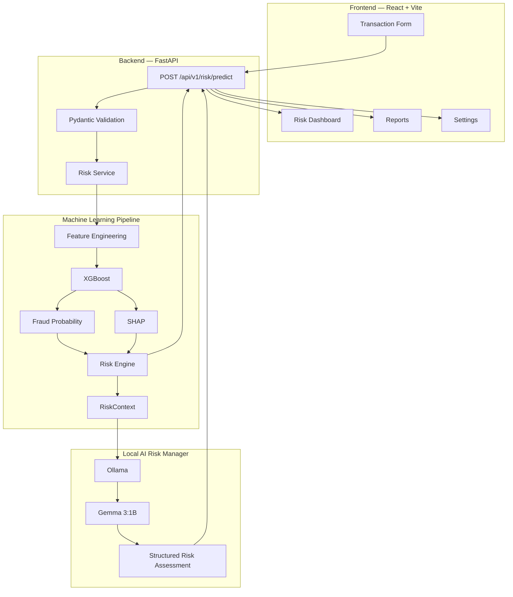
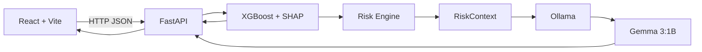
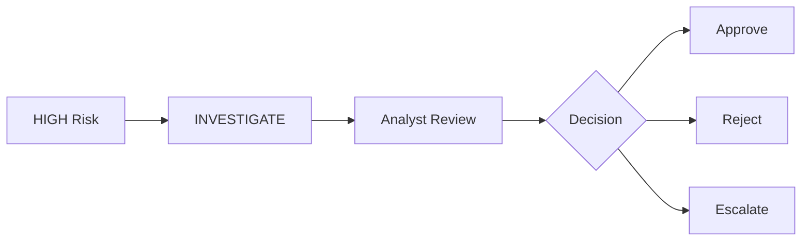

# 🛡️ RiskGuard-AI


### Explainable AI-Powered Fraud Risk Detection & Intelligent Risk Management

> 📐 GitHub-rendered Mermaid diagrams are included for the end-to-end workflow and system architecture.

RiskGuard-AI is an **Explainable AI fraud detection system** designed to identify potentially fraudulent financial transactions, quantify their risk, explain the model's decision using SHAP, and generate an analyst-friendly risk assessment using a locally hosted **Gemma 3:1B** model through Ollama.

The system combines:

- Machine Learning
- Behavioral Analytics
- XGBoost
- SHAP Explainability
- Risk Scoring
- Rule-based Risk Classification
- Local LLM Reasoning
- Structured AI Risk Assessment

---

# 📌 Project Overview

Traditional fraud detection systems generally focus on predicting whether a transaction is fraudulent.

However, a prediction alone is often insufficient for analysts. A fraud analyst needs to know:

> **Why was this transaction considered risky?**

RiskGuard-AI solves this through an end-to-end **ML → XAI → Risk Engine → LLM → API → Dashboard** workflow.

## 🔄 Original RiskGuard-AI Workflow

```mermaid
flowchart TD
    A[Transaction Input] --> B[FastAPI API]
    B --> C[Pydantic Validation]
    C --> D[Feature Engineering]
    D --> E[XGBoost Fraud Classifier]

    E --> F[Fraud Probability]
    E --> G[SHAP Explainability]

    F --> H[Risk Engine]
    G --> H

    H --> I[Risk Score / Level / Action]
    H --> J[RiskContext]

    J --> K[Ollama]
    K --> L[Gemma 3:1B]
    L --> M[Structured AI Risk Assessment]

    I --> N[FastAPI Response]
    M --> N

    N --> O[React + Vite Dashboard]
````

> **Important:** XGBoost makes the fraud prediction and final ML decision. Gemma 3:1B does not override the model; it explains and contextualizes the existing ML + SHAP evidence.

The core principle of RiskGuard is:

> **The ML model makes the fraud prediction. The AI Risk Manager explains and contextualizes the evidence.**

---

# 🎯 Objectives

RiskGuard-AI aims to:

1. Detect fraudulent transactions accurately.
2. Incorporate customer behavioral patterns into fraud detection.
3. Handle severe class imbalance.
4. Use chronological validation to avoid temporal leakage.
5. Optimize the fraud classification threshold.
6. Explain individual predictions using SHAP.
7. Convert model outputs into actionable risk levels.
8. Provide recommended analyst actions.
9. Use a local LLM to generate human-readable explanations.
10. Provide a foundation for a real-time fraud risk management platform.

---

# 🧠 Key Features

## 1. Transaction-Level Fraud Detection

The system uses XGBoost to estimate the probability that a transaction is fraudulent.

Output:

```text
Fraud Probability
Fraud Prediction
Risk Score
Risk Level
Recommended Action
```

---

## 2. Behavioral Fraud Detection

RiskGuard does not rely only on the current transaction.

It also incorporates historical customer behavior.

Important behavioral features include:

* Customer transaction count
* Customer average transaction amount
* Amount ratio
* Time since previous transaction
* Distance between customer and merchant
* Customer history availability

This allows the system to detect transactions that deviate from a customer's normal behavior.

---

## 3. Chronological Data Splitting

Fraud detection is a temporal problem.

Therefore, the dataset was split chronologically instead of randomly shuffling transactions.

### Training Period

```text
2019-01-01 00:00:18
        ↓
2020-06-21 12:13:37
```

### Testing Period

```text
2020-06-21 12:14:25
        ↓
2020-12-31 23:59:34
```

This better represents real-world deployment where the model is trained on historical transactions and evaluated on future transactions.

---

## 📊 Dataset

RiskGuard-AI uses the **Credit Card Transactions Fraud Detection Dataset** from Kaggle.

🔗 **Dataset:**  
https://www.kaggle.com/datasets/kartik2112/fraud-detection

> ⚠️ The dataset is not included in this repository because of its size. Download it directly from Kaggle and place the required files in the appropriate `data/` directory.

---

# 🔍 Feature Engineering

RiskGuard transforms the raw transaction data into model-ready features.

## Transaction Features

* `amt`
* `category`
* `city_pop`
* `gender`

## Temporal Features

* `transaction_hour`
* `day_of_week`
* `is_weekend`
* `is_night`

## Customer Features

* `age`
* `customer_txn_count`
* `customer_avg_amount`
* `has_customer_history`

## Behavioral Features

* `amount_ratio`
* `time_since_last_txn`
* `distance_km`

## Encoded Features

Categorical variables are transformed using OneHotEncoder.

Final model feature count:

```text
29 features
```

---

# 🧮 Final Feature Set

The final XGBoost model uses the following 29 features:

```text
0   amt
1   city_pop
2   transaction_hour
3   day_of_week
4   is_weekend
5   is_night
6   age
7   distance_km
8   customer_txn_count
9   customer_avg_amount
10  amount_ratio
11  time_since_last_txn
12  has_customer_history
13  category_entertainment
14  category_food_dining
15  category_gas_transport
16  category_grocery_net
17  category_grocery_pos
18  category_health_fitness
19  category_home
20  category_kids_pets
21  category_misc_net
22  category_misc_pos
23  category_personal_care
24  category_shopping_net
25  category_shopping_pos
26  category_travel
27  gender_F
28  gender_M
```

---

# 🤖 Machine Learning Model

## XGBoost

RiskGuard uses:

```text
XGBoost Classifier
```

Core configuration:

```python
XGBClassifier(
    n_estimators=500,
    max_depth=6,
    learning_rate=0.05,
    subsample=0.8,
    colsample_bytree=0.8,
    scale_pos_weight=scale_pos_weight,
    objective="binary:logistic",
    eval_metric="aucpr",
    tree_method="hist",
    random_state=42,
    n_jobs=-1
)
```

### Why XGBoost?

XGBoost was selected because it:

* Performs well on tabular data.
* Handles nonlinear relationships.
* Captures feature interactions.
* Supports class weighting.
* Provides probability estimates.
* Works effectively with SHAP.
* Offers strong performance on structured transaction data.

---

# ⚖️ Class Imbalance

Fraudulent transactions represent a very small percentage of the dataset.

To account for this imbalance, the model uses:

```python
scale_pos_weight
```

This increases the importance of the minority fraud class during training.

Because fraud detection is highly imbalanced, accuracy alone is not considered an appropriate primary metric.

---

# 🎯 Threshold Optimization

The default classification threshold of:

```text
0.50
```

was evaluated.

The system then evaluated different probability thresholds to find a better operating point.

The selected threshold is:

```text
0.95
```

This threshold provides a significantly better precision-recall trade-off for the intended fraud investigation workflow.

---

# 📈 Model Performance

## Final Validation Results

```text
===================================
RiskGuard Validation Metrics
===================================

ROC-AUC       : 0.9983
PR-AUC        : 0.8997
Precision     : 0.9011
Recall        : 0.7860
F1 Score      : 0.8396
Specificity   : 0.9997
False Positive Rate : 0.0003

Operating Threshold : 0.95

===================================
```

### Interpretation

### ROC-AUC — 0.9983

The model demonstrates excellent ability to distinguish fraudulent and legitimate transactions across probability thresholds.

### PR-AUC — 0.8997

PR-AUC is particularly important because of the severe class imbalance.

### Precision — 90.11%

Approximately 90% of transactions classified as fraud at the selected threshold are actually fraudulent in the validation data.

### Recall — 78.60%

The system identifies approximately 78.6% of fraudulent transactions.

### F1 Score — 0.8396

The F1 score demonstrates a strong balance between precision and recall.

### Specificity — 99.97%

The model correctly identifies the overwhelming majority of legitimate transactions.

---

# 🧠 Explainable AI with SHAP

RiskGuard uses **SHAP (SHapley Additive exPlanations)** to explain model predictions.

SHAP provides both:

## Global Explainability

Identifies which features have the greatest influence across the evaluated dataset.

```text
Global Feature Importance
        ↓
Which features generally influence fraud predictions?
```

## Local Explainability

Explains why a particular transaction received its prediction.

```text
Individual Transaction
        ↓
SHAP Values
        ↓
Risk-Increasing Factors
Protective Factors
```

---

# 📌 SHAP Interpretation

RiskGuard uses the following interpretation:

```text
Positive SHAP
      ↓
Pushes prediction toward fraud
```

```text
Negative SHAP
      ↓
Pushes prediction away from fraud
```

For example:

```text
amt
SHAP = -3.43
```

means the transaction amount contributed strongly in the direction of reducing the model's fraud prediction.

Whereas:

```text
category_shopping_pos
SHAP = +0.07
```

means that feature pushed the model slightly toward fraud.

SHAP values are treated as **model evidence**, not causal explanations.

---

# 🛡️ Risk Engine

The Risk Engine converts the model probability into an operational risk score.

```text
risk_score = fraud_probability × 100
```

Risk levels:

```text
0 – <30     → LOW

30 – <70    → MEDIUM

70 – 100    → HIGH
```

Recommended actions:

```text
LOW
 ↓
ALLOW
```

```text
MEDIUM
 ↓
REVIEW
```

```text
HIGH
 ↓
INVESTIGATE
```

---

# 📦 RiskContext

The model output and SHAP evidence are combined into a structured `RiskContext`.

Example:

```json
{
  "fraud_probability": 0.8734,
  "risk_score": 87.34,
  "risk_level": "HIGH",
  "fraud_prediction": 1,
  "recommended_action": "INVESTIGATE"
}
```

The context also contains:

* Transaction information
* Behavioral features
* Risk-increasing SHAP factors
* Protective SHAP factors

This structured representation acts as the bridge between the ML system and the LLM.

---

# 🧠 AI Risk Manager

RiskGuard includes an AI Risk Manager powered by:

```text
Ollama
   ↓
Gemma 3:1B
```

The LLM is used for **risk interpretation**, not fraud classification.

## Architecture

```text
XGBoost
    ↓
Fraud Probability
    ↓
Risk Engine
    ↓
SHAP Evidence
    ↓
RiskContext
    ↓
Gemma 3:1B
    ↓
Structured Risk Assessment
```

---

# 🔒 LLM Safety / Grounding Rules

The AI Risk Manager follows strict rules:

1. It cannot override the XGBoost prediction.
2. Positive SHAP values are treated as risk-increasing evidence.
3. Negative SHAP values are treated as protective evidence.
4. It cannot invent evidence.
5. It cannot claim causal relationships from SHAP.
6. It must distinguish model evidence from interpretation.
7. It produces structured JSON output.
8. The output is validated using Pydantic.

This makes the LLM an **explanation and decision-support layer**, rather than an uncontrolled decision maker.

---

# 🧪 Example Risk Assessment

Example transaction:

```text
Amount                 : $2.86
Category               : personal_care
Transaction Hour      : 12
Gender                 : M
Customer Transactions : 1561
Average Amount        : $70.302
Amount Ratio          : 0.041
Time Since Last Txn   : 1522.383 minutes
Distance              : 24.561 km
Customer History      : Yes
```

RiskGuard produced:

```text
Fraud Probability : 87.34%
Risk Score        : 87.34
Risk Level        : HIGH
ML Decision       : FRAUD
Recommended Action: INVESTIGATE
```

The AI Risk Manager then generated an explanation using the model's structured evidence.

---

# 🏗️ System Architecture

GitHub renders Mermaid diagrams directly inside Markdown README files.



## Technology Flow



---

# 📁 Project Structure

```text
RiskGuard-AI/
│
├── data/
│   ├── raw/
│   ├── processed/
│   └── interim/
│
├── ml/
│
├── models/
│
├── backend/
│   ├── api/
│   │   └── risk.py
│   ├── schemas/
│   │   └── risk.py
│   ├── services/
│   │   └── risk_service.py
│   ├── agent/
│   │   ├── schemas.py
│   │   ├── evidence.py
│   │   ├── risk_engine.py
│   │   └── ...
│   ├── main.py
│   └── ...
│
├── frontend/
│   ├── src/
│   ├── public/
│   └── ...
│
├── notebooks/
│   ├── dataset inspection
│   ├── feature engineering
│   ├── model training
│   └── explainability experiments
│
├── docs/
│
├── README.md
├── requirements.txt
└── .gitignore
```

---

# 💻 Technology Stack

## Machine Learning

* Python
* Pandas
* NumPy
* Scikit-learn
* XGBoost
* SHAP

## AI / LLM

* Ollama
* Gemma 3:1B

## Backend

* Python
* FastAPI
* Pydantic

## Frontend

* React
* Vite
* Tailwind CSS

## Development

* Jupyter Notebook
* VS Code
* Git
* GitHub

---

# 📦 Installation

Clone the repository:

```bash
git clone <YOUR_GITHUB_REPOSITORY_URL>

cd RiskGuard-AI
```

Create a Python virtual environment:

```bash
python3 -m venv backend/venv
```

Activate it:

### macOS / Linux

```bash
source backend/venv/bin/activate
```

### Windows

```bash
backend\venv\Scripts\activate
```

Install dependencies:

```bash
pip install -r requirements.txt
```

---

# 🧠 Ollama Setup

Install Ollama and make sure the server is running.

Pull Gemma 3:1B:

```bash
ollama pull gemma3:1b
```

Run:

```bash
ollama run gemma3:1b
```

Verify the Ollama API:

```bash
curl http://localhost:11434/api/tags
```

The response should contain:

```text
gemma3:1b
```

RiskGuard communicates with:

```text
http://localhost:11434
```
---
## 📊 Dataset

RiskGuard-AI uses the **Credit Card Transactions Fraud Detection Dataset** from Kaggle.

🔗 **Dataset:**  
https://www.kaggle.com/datasets/kartik2112/fraud-detection

> ⚠️ The dataset is not included in this repository because of its size. Download it directly from Kaggle and place the required files in the appropriate `data/` directory.

---

# 📓 Notebook Workflow

The notebooks document the development process.

Recommended execution order:

```text
1. Dataset Inspection
        ↓
2. Data Preprocessing
        ↓
3. Feature Engineering
        ↓
4. Behavioral Feature Construction
        ↓
5. Chronological Train/Test Split
        ↓
6. XGBoost Training
        ↓
7. Threshold Optimization
        ↓
8. Model Evaluation
        ↓
9. SHAP Global Analysis
        ↓
10. SHAP Local Analysis
        ↓
11. Risk Engine
        ↓
12. RiskContext
        ↓
13. Gemma 3:1B Risk Assessment
```

---

# 🔬 Important ML Design Decisions

## Why chronological splitting?

Random train-test splitting can allow future behavioral information to influence training.

Fraud detection is inherently temporal.

Therefore:

```text
Past → Training

Future → Testing
```

better represents real deployment.

---

## Why behavioral features?

A transaction may look normal in isolation but suspicious relative to a customer's historical behavior.

For example:

```text
Current Amount
      ÷
Customer Average Amount
      =
Amount Ratio
```

A large deviation from historical behavior can provide an important fraud signal.

---

## Why PR-AUC?

Fraud is a rare event.

When the positive class is extremely small, ROC-AUC alone can appear overly optimistic.

Therefore, RiskGuard also evaluates:

```text
Precision
Recall
F1
PR-AUC
```

---

## Why threshold optimization?

A fraud detection system has asymmetric costs.

False positives can cause:

* unnecessary investigations
* customer friction
* operational cost

False negatives can allow:

* fraudulent transactions
* financial losses

Therefore, the threshold is selected according to the intended operational trade-off rather than blindly using `0.5`.

---

# 🚀 Current Implementation Status

| Component                | Status     |
| ------------------------ | ---------- |
| Dataset inspection       | ✅ Complete |
| Data preprocessing       | ✅ Complete |
| Chronological split      | ✅ Complete |
| Behavioral features      | ✅ Complete |
| XGBoost model            | ✅ Complete |
| Class imbalance handling | ✅ Complete |
| Threshold optimization   | ✅ Complete |
| Model evaluation         | ✅ Complete |
| Global SHAP              | ✅ Complete |
| Local SHAP               | ✅ Complete |
| Risk Engine              | ✅ Complete |
| RiskContext              | ✅ Complete |
| Gemma 3:1B integration   | ✅ Complete |
| Structured AI output     | ✅ Complete |
| FastAPI integration      | ✅ Complete |
| React dashboard          | ✅ Complete |
| Real-time API workflow   | ✅ Complete |
| Reports / Settings UI    | ✅ Complete |
| Production deployment    | 🔄 Future  |

---

# 🔮 Future Scope

## 1. Production Deployment

Deploy the FastAPI backend and React frontend using a secure production architecture.

## 2. Model Monitoring

Production deployment can monitor:

* Model drift
* Feature drift
* Fraud rate
* False positives
* False negatives
* Threshold performance
* LLM response quality

## 3. Analyst Workflow

Future versions can support:



## 4. Authentication and Auditability

Future production versions can add:

* User authentication
* Role-based access control
* Analyst audit logs
* API authentication
* Secure transaction logging

## 5. Continuous Model Improvement

Future versions can support periodic retraining using newly labeled fraud cases while preserving chronological validation.

---

# ⚠️ Limitations

The current implementation is a research/prototype system.

Important limitations include:

* The dataset is historical.
* Model performance may differ on real-world transactions.
* SHAP explains model behavior, not causality.
* Fraud probability should not be interpreted as certainty of fraud.
* The LLM is an explanation layer and should not independently determine fraud.
* Real-world deployment requires monitoring and periodic retraining.
* Production deployment requires proper authentication, authorization, logging, and security controls.

---

# 🔐 Responsible AI Considerations

RiskGuard is designed around a human-in-the-loop approach.

The system should support analysts rather than automatically make irreversible decisions.

The architecture separates:

```text
Prediction
    ↓
Explanation
    ↓
Recommendation
    ↓
Human Decision
```

This helps maintain transparency and accountability.

---

# 👤 Project Status

RiskGuard-AI demonstrates the complete application workflow:

```text
ML → XAI → Risk Engine → LLM → FastAPI → React
```

The research pipeline is now connected to a working application using:

```text
FastAPI + React + XGBoost + SHAP + Ollama + Gemma 3:1B
```

---

# 📌 Key Takeaway

RiskGuard-AI is not simply a fraud classifier.

It combines:

```text
Machine Learning

      +

Behavioral Analytics

      +

Explainable AI

      +

Risk Scoring

      +

Local LLM
```

to transform:

```text
"Is this transaction fraudulent?"
```

into:

```text
"How risky is this transaction,

why did the model flag it,

what evidence supports that decision,

and what should the analyst do next?"
```

---

# 📜 License

This project is intended for educational, research, and demonstration purposes.

Add an appropriate open-source license before public production use.

---

# 👤 Author

**Sandip Biswal**

Computer Engineering Student

**RiskGuard-AI — Explainable AI Fraud Risk Management System**